# Diagrama de clases — Módulo de autenticación

Relaciones entre las clases que intervienen cuando se llama a un endpoint de `/auth`:
el router recibe el DTO validado por Pydantic, `CredentialsFactory` lo traduce a
`Credentials`, FastAPI inyecta un `Auth` ya ensamblado por el composition root
(`dependencies.get_auth`) y `Auth` delega en la estrategia correspondiente.

```mermaid
classDiagram
    direction TB

    %% ───────────── Capa HTTP ─────────────
    namespace API {
        class router {
            <<module>>
            +register(peticion: RegisterRequest, auth: EmailAuth) UsuarioPublic
            +login(peticion: LoginRequest, auth: EmailAuth, settings: Settings) TokenResponse
            +recover_password(peticion: RecoverPasswordRequest, auth: EmailAuth) GenericMessageResponse
            +verify_session(auth: EmailAuth) SessionInfoResponse
        }
        class RegisterRequest {
            <<Pydantic DTO>>
            +email: EmailStr
            +password: str
            +nombre: str
            +apellido: str
        }
        class LoginRequest {
            <<Pydantic DTO>>
            +email: EmailStr
            +password: str
        }
        class RecoverPasswordRequest {
            <<Pydantic DTO>>
            +email: EmailStr
        }
    }

    %% ───────────── Creación de credenciales ─────────────
    namespace Credenciales {
        class CredentialsFactory {
            <<Simple Factory>>
            +create_credentials(peticion: Peticion) Credentials$
        }
        class Credentials {
            <<abstract>>
            +identifier: str*
        }
        class EmailCredentials {
            +email: str
            +password: str
            +identifier: str
        }
        class EmailRegistration {
            +email: str
            +password: str
            +nombre: str
            +apellido: str
            +identifier: str
        }
        class EmailRecoveryRequest {
            +email: str
            +identifier: str
        }
    }

    %% ───────────── Inyección de dependencias ─────────────
    namespace ComposicionDI {
        class dependencies {
            <<composition root>>
            -_password_hasher: Argon2PasswordHasher
            -_login_attempts_store: InMemoryLoginAttemptsStore
            +get_auth(...) EmailAuth
            +get_user_repository(session) UserRepository
            +get_token_service(session, settings) TokenService
            +get_password_hasher() PasswordHasher
            +get_reset_token_repository(session) SQLAlchemyPasswordResetTokenRepository
            +get_auth_event_publisher() AuthEventPublisher
            +get_login_attempts_store() InMemoryLoginAttemptsStore
        }
    }

    %% ───────────── Strategy ─────────────
    namespace Strategy {
        class Auth {
            <<context>>
            -sign_in_behavior: SignInBehavior~SignInC~
            -register_behavior: RegisterBehavior~RegisterC~
            -verify_behavior: VerifyBehavior
            -recovery_behavior: RecoveryBehavior~RecoveryC~
            +sign_in(credentials: SignInC) AuthResult
            +register(credentials: RegisterC) RegisteredUser
            +verify_session() SessionInfo
            +recover_password(credentials: RecoveryC) None
        }
        class SignInBehavior~C~ {
            <<interface>>
            +sign_in(credentials: C) AuthResult
        }
        class RegisterBehavior~C~ {
            <<interface>>
            +register(credentials: C) RegisteredUser
        }
        class VerifyBehavior {
            <<interface>>
            +verify_session() SessionInfo
        }
        class RecoveryBehavior~C~ {
            <<interface>>
            +recover_password(credentials: C) None
        }
        class EmailSignIn {
            -user_repository: UserRepository
            -password_hasher: PasswordHasher
            -token_service: TokenService
            -event_publisher: AuthEventPublisher
            +sign_in(credentials: EmailCredentials) AuthResult
        }
        class RateLimitedSignIn~C~ {
            <<decorator>>
            -wrapped: SignInBehavior~C~
            -attempts_store: LoginAttemptsStore
            -max_attempts: int
            -lockout_window: timedelta
            +sign_in(credentials: C) AuthResult
        }
        class EmailRegister {
            -user_repository: UserRepository
            -password_hasher: PasswordHasher
            -event_publisher: AuthEventPublisher
            +register(credentials: EmailRegistration) RegisteredUser
        }
        class EmailVerify {
            -token_service: TokenService
            -event_publisher: AuthEventPublisher
            -access_token: Optional~str~
            -refresh_token: Optional~str~
            +verify_session() SessionInfo
        }
        class EmailRecovery {
            -user_repository: UserRepository
            -reset_token_repository: PasswordResetTokenRepository
            -event_publisher: AuthEventPublisher
            -reset_token_ttl: timedelta
            +recover_password(credentials: EmailRecoveryRequest) None
        }
        class UnsupportedRecovery {
            <<null object>>
            -provider: str
            +recover_password(credentials: Credentials) None
        }
    }

    %% ───────────── Puertos (Protocols) y adaptadores ─────────────
    namespace PuertosYAdaptadores {
        class UserRepository {
            <<interface>>
            +get_by_email(email) Usuario
            +get_by_id(usuario_id) Usuario
            +create(email, password_hash, nombre, apellido) Usuario
        }
        class SQLAlchemyUserRepository
        class PasswordHasher {
            <<interface>>
            +hash(plain_password) str
            +verify(plain_password, password_hash) bool
        }
        class Argon2PasswordHasher
        class TokenService {
            <<interface>>
            +create_access_token(usuario) str
            +decode_access_token(token) AccessTokenPayload
            +issue_refresh_token(usuario_id) str
            +resolve_refresh_token(raw_token) UserRecord
            +revoke_refresh_token(raw_token) None
        }
        class JoseTokenService
        class PasswordResetTokenRepository {
            <<interface>>
            +create(usuario_id, token_hash, expires_at) None
        }
        class SQLAlchemyPasswordResetTokenRepository
        class LoginAttemptsStore {
            <<interface>>
            +is_locked(key, max_attempts, window) bool
            +register_failure(key) None
            +reset(key) None
        }
        class InMemoryLoginAttemptsStore
        class AuthEventPublisher {
            <<singleton>>
            -_instance: AuthEventPublisher$
            +get_instance() AuthEventPublisher$
            +publish(event: AuthEvent) None
        }
    }

    %% ── Llamado al endpoint ──
    router ..> RegisterRequest : recibe
    router ..> LoginRequest : recibe
    router ..> RecoverPasswordRequest : recibe
    router ..> CredentialsFactory : create_credentials(peticion)
    router ..> dependencies : Depends(get_auth)
    router --> Auth : delega (EmailAuth inyectado)

    %% ── Creación de credenciales ──
    CredentialsFactory ..> RegisterRequest : lee
    CredentialsFactory ..> LoginRequest : lee
    CredentialsFactory ..> RecoverPasswordRequest : lee
    CredentialsFactory ..> EmailRegistration : «create»
    CredentialsFactory ..> EmailCredentials : «create»
    CredentialsFactory ..> EmailRecoveryRequest : «create»
    Credentials <|-- EmailCredentials
    Credentials <|-- EmailRegistration
    Credentials <|-- EmailRecoveryRequest

    %% ── Strategy: el contexto agrega las 4 estrategias ──
    Auth "1" o-- "1" SignInBehavior
    Auth "1" o-- "1" RegisterBehavior
    Auth "1" o-- "1" VerifyBehavior
    Auth "1" o-- "1" RecoveryBehavior
    Auth ..> Credentials : SignInC, RegisterC, RecoveryC

    SignInBehavior <|.. EmailSignIn
    SignInBehavior <|.. RateLimitedSignIn
    RateLimitedSignIn o-- SignInBehavior : wrapped
    RegisterBehavior <|.. EmailRegister
    VerifyBehavior <|.. EmailVerify
    RecoveryBehavior <|.. EmailRecovery
    RecoveryBehavior <|.. UnsupportedRecovery

    EmailSignIn ..> EmailCredentials : usa
    EmailRegister ..> EmailRegistration : usa
    EmailRecovery ..> EmailRecoveryRequest : usa

    %% ── Las estrategias dependen solo de puertos (DIP) ──
    EmailSignIn --> UserRepository
    EmailSignIn --> PasswordHasher
    EmailSignIn --> TokenService
    EmailSignIn --> AuthEventPublisher
    EmailRegister --> UserRepository
    EmailRegister --> PasswordHasher
    EmailRegister --> AuthEventPublisher
    EmailVerify --> TokenService
    EmailVerify --> AuthEventPublisher
    EmailRecovery --> UserRepository
    EmailRecovery --> PasswordResetTokenRepository
    EmailRecovery --> AuthEventPublisher
    RateLimitedSignIn --> LoginAttemptsStore

    UserRepository <|.. SQLAlchemyUserRepository
    PasswordHasher <|.. Argon2PasswordHasher
    TokenService <|.. JoseTokenService
    PasswordResetTokenRepository <|.. SQLAlchemyPasswordResetTokenRepository
    LoginAttemptsStore <|.. InMemoryLoginAttemptsStore

    %% ── Composition root: único lugar que conoce lo concreto ──
    dependencies ..> Auth : «create»
    dependencies ..> RateLimitedSignIn : «create»
    dependencies ..> EmailSignIn : «create»
    dependencies ..> EmailRegister : «create»
    dependencies ..> EmailVerify : «create» (inyecta tokens de la request)
    dependencies ..> EmailRecovery : «create»
    dependencies ..> SQLAlchemyUserRepository : «create»
    dependencies ..> JoseTokenService : «create»
    dependencies ..> SQLAlchemyPasswordResetTokenRepository : «create»
    dependencies ..> Argon2PasswordHasher : instancia por proceso
    dependencies ..> InMemoryLoginAttemptsStore : instancia por proceso
    dependencies ..> AuthEventPublisher : get_instance()

    note for Auth "EmailAuth = Auth[EmailCredentials, EmailRegistration, EmailRecoveryRequest]"
```

## Cómo leer el diagrama

**1. Llamado al endpoint (`router`).** Cada endpoint recibe un DTO Pydantic ya validado
(`RegisterRequest`, `LoginRequest`, `RecoverPasswordRequest`) y declara
`auth: EmailAuth = Depends(get_auth)`. El router no construye nada concreto: solo pide las
credenciales a `CredentialsFactory` y delega la operación en `Auth`. `verify_session` no
recibe DTO porque la sesión viaja en el header `Authorization` y en la cookie `refresh_token`.

**2. Creación de credenciales (Simple Factory).** `CredentialsFactory.create_credentials` es
estático y está sobrecargado: según el tipo de DTO devuelve `EmailRegistration`,
`EmailCredentials` o `EmailRecoveryRequest`. Las tres heredan de la clase abstracta
`Credentials`, cuyo único miembro común es `identifier` (lo usa `RateLimitedSignIn` como clave
de throttling).

**3. Inyección de dependencias (composition root).** `dependencies.py` es el único módulo que
conoce las implementaciones concretas (SQLAlchemy, argon2, jose). FastAPI resuelve el árbol
`Depends` por request: `get_auth` recibe repositorio, hasher, token service, publisher, store
de intentos, settings y los tokens de la request, arma las 4 estrategias y devuelve un `Auth`
nuevo. Tienen ciclo de vida distinto:
- **Por request:** `Auth`, las estrategias, los repositorios SQLAlchemy y `JoseTokenService`
  (comparten la `AsyncSession` de la request).
- **Por proceso:** `Argon2PasswordHasher` e `InMemoryLoginAttemptsStore` (variables de módulo;
  el store debe persistir entre requests para que el rate limiting funcione).
- **Singleton:** `AuthEventPublisher.get_instance()`, porque los observers se suscriben una
  sola vez en el startup.

**4. Patrón Strategy.** `Auth` es el contexto: **agrega** (no hereda) una estrategia por cada
una de las 4 interfaces (`SignInBehavior`, `RegisterBehavior`, `VerifyBehavior`,
`RecoveryBehavior`, definidas como `typing.Protocol`) y delega 1:1 en ellas. Las interfaces son
genéricas en `C: Credentials`, de modo que cada estrategia declara qué credenciales concretas
acepta. Variantes destacadas:
- **`RateLimitedSignIn` (Decorator):** implementa `SignInBehavior` y a la vez envuelve otro
  `SignInBehavior` (`EmailSignIn`). `Auth` lo recibe sin enterarse.
- **`UnsupportedRecovery` (Null Object):** estrategia de recuperación para proveedores OAuth
  futuros; acepta cualquier `Credentials` y lanza `PasswordRecoveryNotSupportedError`.
- **`EmailVerify`:** recibe el access/refresh token por constructor, por eso
  `verify_session()` no tiene parámetros.

Las estrategias concretas dependen solo de puertos (`UserRepository`, `PasswordHasher`,
`TokenService`, `PasswordResetTokenRepository`, `LoginAttemptsStore`), nunca de los adaptadores
concretos, que se enchufan en el composition root (DIP).
