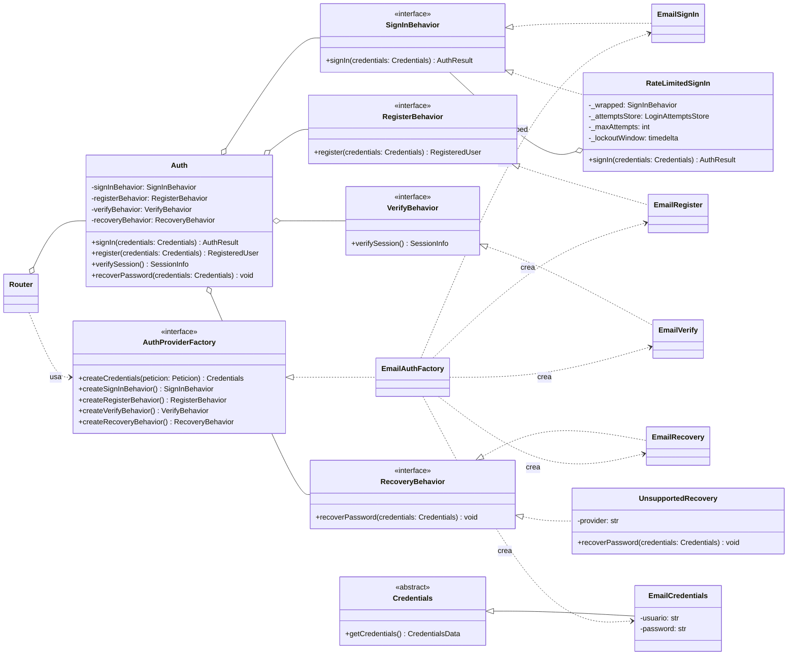

# Plan de producto y arquitectura — Plataforma de descubrimiento de eventos por geolocalización

## Contexto

El problema que motiva el producto: la oferta de actividades de una zona está fragmentada entre
los canales de cada organizador (redes del bar, del teatro, de la banda, de la marca). Si no
seguís a quien organiza, no te enterás. La hipótesis es que centralizar esa oferta y hacerla
navegable **por ubicación, fecha y categoría** — en vez de por organizador — resuelve tanto el
caso "qué hago hoy acá" como el caso "qué voy a hacer en Mar del Plata la semana que viene".

Este plan cubre un entregable con doble naturaleza, definida por vos en la sesión de planning:
es el **trabajo práctico de Programación 2** (equipo de 3-5 personas, pocas semanas, con CI/CD y
control de versiones como criterio de evaluación explícito) y a la vez la **base de un producto
real a futuro**. Esa dualidad es la que gobierna casi todas las decisiones de abajo: se prioriza
lo que se puede terminar y defender en el plazo, sin cerrar puertas arquitectónicas que después
obliguen a reescribir.

Repositorio: `franconieto3/Programacion_2_Grupo_2` — hoy vacío (solo `README.md`, 1 commit).
No hay código heredado ni restricciones previas.

---

## 1. Decisiones ya tomadas (cerradas en el planning)

| Tema | Decisión |
|---|---|
| Naturaleza | TP ahora, producto después → arquitectura desacoplada (API + SPA) |
| Restricción de stack | Backend en Python obligatorio, framework de APIs **FastAPI**; frontend libre |
| Plataforma | Web responsive **mobile-first**. Sin app nativa ni PWA en el MVP |
| Equipo / plazo | 3-5 personas, dedicación parcial, 4-8 semanas |
| Alcance geográfico | **Multi-ciudad por diseño**, sin ciudad hardcodeada |
| Oferta inicial | Sin ETL. Seed manual del equipo + carga de oferentes reales |
| Mapas | OpenStreetMap, sin costo ni tarjeta |
| Recurrencia | Fuera del MVP. Solo eventos únicos (con el modelo preparado) |
| Roles | **Cuentas separadas** demandante / oferente desde el registro |
| Categorías | Catálogo **cerrado**, **varias por evento** |
| Radio de búsqueda | **Viewport**: se busca lo que entra en el rectángulo visible del mapa |
| Autenticación | Email + contraseña propio (sin login social) |
| Experiencia del equipo | React/TS y SQL sí; backend Python y Docker **no** |
| Features opcionales | Ninguna entra al MVP (sin favoritos, sin publicidad, sin analítica) |

---

## 2. Stack tecnológico propuesto

### Backend — **FastAPI + SQLAlchemy + Alembic + Pydantic**, Python 3.12

Requisito no funcional fijado por el equipo: el framework de las APIs es **FastAPI**. Es además
la opción más alineada con las preferencias declaradas (Pydantic, async, tipado): validación por
tipos, documentación OpenAPI automática y async nativo.

A diferencia de Django, FastAPI no trae resuelto de fábrica ninguno de los cuatro bloques que el
MVP necesita, así que hay que decidir explícitamente cómo se cubre cada uno:

- **Autenticación y hashing.** Se implementa a mano sobre `passlib`/`argon2-cffi` para el hash de
  contraseñas y `python-jose` (o `pyjwt`) para emitir y validar JWT, usando las utilidades de
  seguridad de FastAPI (`OAuth2PasswordBearer`, dependencias de autenticación) como esqueleto.
- **Migraciones de esquema.** Alembic sobre los modelos de SQLAlchemy. No hay generación
  automática "gratis" como en Django; cada migración se revisa a mano.
- **ORM sobre SQL.** SQLAlchemy 2.0 (estilo declarativo), terreno que el equipo ya domina en SQL
  aunque no en el ORM específico.
- **Panel de administración.** FastAPI no trae uno autogenerado. Se cubre con **SQLAdmin**
  (panel de administración para SQLAlchemy, montable directo sobre la app de FastAPI) para el
  seed manual de eventos y la moderación de publicaciones. Si SQLAdmin no alcanza para algún
  flujo puntual, la alternativa de respaldo es un script de carga (`scripts/seed.py`) más un
  endpoint protegido de moderación.

**Costo aceptado de esta decisión:** estos cuatro bloques representan trabajo adicional real
frente a Django (estimado en 1,5-2 semanas sobre un plazo de 4-8 semanas) para un equipo que
además está aprendiendo Python web. El async de FastAPI no aporta demasiado en este proyecto — la
carga es I/O contra una sola base de datos con pocos usuarios concurrentes, no hay mucho que
paralelizar —, pero se adopta igual porque es el modelo de programación nativo del framework.

**Alternativas evaluadas y descartadas:**

- **Django 5 + Django REST Framework.** Habría resuelto auth, migraciones y panel de
  administración sin código propio, a costa de no cumplir el requisito de framework fijado
  (FastAPI). Queda descartado por esa restricción, no por mérito técnico.
- **Flask.** Minimalista; arrastra las mismas carencias que FastAPI en auth, migraciones y
  backoffice, sin ofrecer a cambio tipado ni documentación automática. Peor en ambos ejes frente
  a FastAPI.
- **Next.js full-stack.** Descartado directamente por la restricción de backend en Python.

### Diseño del módulo de autenticación (`backend/app/auth/`)

El módulo implementa el diagrama de clases de la cátedra con varios patrones GoF:

- **Strategy:** `Auth` es el contexto y compone 4 interfaces (`SignInBehavior`,
  `RegisterBehavior`, `VerifyBehavior`, `RecoveryBehavior`, definidas como `typing.Protocol`).
- **Abstract Factory:** `AuthProviderFactory` crea la familia completa de un proveedor
  (credenciales + las 4 estrategias). Hoy existe `EmailAuthFactory` (`app/auth/factories.py`).
- **Decorator:** `RateLimitedSignIn` envuelve cualquier `SignInBehavior` para limitar intentos.
- **Null Object:** `UnsupportedRecovery` cumple `RecoveryBehavior` en proveedores sin contraseña
  local y lanza `PasswordRecoveryNotSupportedError` (HTTP 400) en vez de dejar un `None` en `Auth`.
- **Observer + Singleton:** `AuthEventPublisher` publica los eventos de dominio de auth.

#### De Simple Factory a Abstract Factory

La versión inicial usaba un **Simple Factory** (`CredentialsFactory.create_credentials`) llamado
desde el router, mientras que las estrategias se ensamblaban por separado en
`dependencies.get_auth()`. Mientras solo existía Email no había problema, pero al proyectar
proveedores OAuth las credenciales y las estrategias pasan a ser **familias de productos
relacionados y dependientes**:

| Familia  | Credenciales          | SignIn           | Register           | Verify        | Recovery              |
|----------|-----------------------|------------------|--------------------|---------------|-----------------------|
| Email    | `EmailCredentials`    | `EmailSignIn`    | `EmailRegister`    | `EmailVerify` | `EmailRecovery`       |
| Google   | `GoogleCredentials`   | `GoogleSignIn`   | `GoogleRegister`   | `EmailVerify` | `UnsupportedRecovery` |
| Facebook | `FacebookCredentials` | `FacebookSignIn` | `FacebookRegister` | `EmailVerify` | `UnsupportedRecovery` |

Con dos puntos de creación desconectados, nada impedía que el router creara
`GoogleCredentials` mientras `get_auth` inyectaba `EmailSignIn`. El **Abstract Factory** resuelve
eso: `get_auth_factory()` resuelve **una** fábrica por request (FastAPI cachea la dependencia), y
de ella salen tanto las credenciales (en el router) como las estrategias (en `get_auth`). Sumar
Google o Facebook es crear `GoogleAuthFactory`/`FacebookAuthFactory` y elegirla en
`get_auth_factory()` según el proveedor, sin tocar `Auth`, el router ni las estrategias
existentes (OCP). Como `RateLimitedSignIn` se aplica en `get_auth` sobre el producto de la
fábrica, todo proveedor nuevo hereda el rate limiting automáticamente. `CredentialsFactory` se
conserva: `EmailAuthFactory.create_credentials` le delega la traducción DTO → `EmailCredentials`.

`CredentialsData` (`TypedDict`, `total=False`) suma los campos opcionales `oauth_token` y
`provider`, así que las credenciales OAuth cumplen el mismo contrato `get_credentials()` que
`EmailCredentials` (LSP).

#### Correcciones al diagrama UML original

1. **Relación `Router` – `Auth`:** el rombo de agregación va del lado de `Router`, que es quien
   usa/contiene a `Auth` (equivale a una asociación dirigida `Router --> Auth`). En el original
   estaba del lado de `Auth`.
2. **Decorator `RateLimitedSignIn`:** su caja de clase explicita el atributo privado envuelto
   (`- _wrapped: SignInBehavior`) y los parámetros de configuración (`- _max_attempts: int`,
   `- _lockout_window: timedelta`, además del `- _attempts_store: LoginAttemptsStore`).
3. **Tipos de retorno explícitos**, tanto en `Auth` como en las interfaces:
   `+signIn(credentials: Credentials): AuthResult`,
   `+register(credentials: Credentials): RegisteredUser`, `+verifySession(): SessionInfo` y
   `+recoverPassword(credentials: Credentials): void`.



### Base de datos — **PostgreSQL 16, sin PostGIS**

Esto es contraintuitivo y conviene entender por qué. Al elegir búsqueda **por viewport**, la
consulta geoespacial se reduce a un rectángulo:

```sql
WHERE latitud  BETWEEN :sur  AND :norte
  AND longitud BETWEEN :oeste AND :este
```

Eso es un simple rango sobre dos columnas numéricas. Un índice B-tree compuesto lo resuelve en
tiempo logarítmico y no requiere ninguna extensión geoespacial. **PostGIS agrega una dependencia
de infraestructura no trivial —para un equipo sin experiencia en Docker— a cambio de capacidades
que el MVP no usa** (distancias geodésicas exactas, polígonos, índices GiST). Entra en la fase 2,
cuando aparezcan "ordenar por cercanía real" o "eventos dentro de este barrio".

Complejidad de la consulta principal: **O(log n + k)** con `k` = eventos en el viewport, contra
**O(n)** de un scan completo. Con el seed del TP (cientos de filas) la diferencia es invisible,
pero el índice correcto desde el día 1 no cuesta nada y es defendible en la evaluación.

- *Descartado — SQLite en producción*: se usa solo para la suite de tests (arranque instantáneo,
  aislamiento por test). En desarrollo y producción va PostgreSQL para que no haya divergencia
  de comportamiento entre entornos.
- *Descartado — MongoDB*: los datos son fuertemente relacionales (usuario → oferente → evento →
  categorías) y el equipo sabe SQL. No hay ningún argumento a favor.

### Frontend — **React 18 + TypeScript + Vite**

Es donde el equipo ya es productivo; con el plazo que hay, esto pesa más que cualquier otra
consideración. Vite por velocidad de arranque y cero configuración.

- **Mapa: Leaflet + react-leaflet**, con tiles raster de OpenStreetMap.
  *Descartado — MapLibre GL*: mejor rendimiento con muchos marcadores y tiles vectoriales, pero
  necesita un proveedor de estilos/tiles configurado aparte. Más setup del que justifica el MVP.
  *Descartado — Mapbox / Google Maps*: mejor calidad de datos, pero exigen cuenta con facturación.
- **Estado del servidor: TanStack Query.** Los filtros de búsqueda generan un caso clásico de
  cacheo por clave (viewport + fechas + horario + categorías); resolverlo a mano con `useEffect`
  produce race conditions cuando el usuario arrastra el mapa rápido. Esto es un bug real y
  frecuente, no una optimización prematura.
- Estilos: CSS Modules o Tailwind, indistinto. No es una decisión arquitectónica.

### Calidad y CI/CD (criterio de evaluación explícito de la cátedra)

- **Tests: pytest + httpx (`AsyncClient`/`TestClient` de FastAPI) + factory_boy.** El foco de cobertura va sobre la lógica de
  búsqueda y filtrado, que es donde de verdad se rompen las cosas (bordes del viewport,
  antimeridiano, rangos de fecha invertidos, filtro de hora que cruza medianoche).
- **Lint/format: Ruff** (reemplaza flake8 + black + isort en una sola herramienta).
- **CI: GitHub Actions** en cada push y PR — ruff → pytest → build del frontend → vitest.
- **Flujo de trabajo:** `main` protegida, ramas por feature, merge solo vía PR con CI en verde y
  al menos una revisión. Al ser un ítem evaluado, conviene que el historial de PRs sea legible:
  es la evidencia del proceso.
- **Despliegue**: no es requisito de la cátedra. Si lo quieren igual, la vía sin tarjeta y sin
  Docker es Render o Fly.io para la API + Neon para PostgreSQL + Vercel/Netlify para el front.

---

## 3. Modelo de datos inicial

Convención: nombres en español para coincidir con el dominio y la documentación del TP.
Todos los timestamps se almacenan en **UTC** y se presentan en hora local.

### `Usuario`
Modelo de autenticación propio (tabla SQLAlchemy), con el email como identificador.

| Campo | Tipo | Notas |
|---|---|---|
| `id` | UUID | PK. UUID y no autoincremental: no filtra volumen de usuarios ni permite enumeración |
| `email` | str | **único**, login |
| `password_hash` | str | hash generado con `argon2-cffi`/`passlib`. Nunca en texto plano |
| `nombre` | str | |
| `rol` | enum | `DEMANDANTE` \| `OFERENTE`. **Excluyente** (decisión: cuentas separadas) |
| `activo`, `creado_en` | bool, datetime | |

> El rol es excluyente por decisión de producto. Aun así vive en una sola tabla: si en el futuro
> se decide unificar cuentas, el cambio es relajar una validación, no una migración de datos.

### `PerfilOferente` (1:1 con `Usuario` donde `rol = OFERENTE`)

| Campo | Tipo | Notas |
|---|---|---|
| `usuario_id` | FK | PK y FK |
| `nombre_publico` | str | Lo que ve el demandante ("Bar Los Pinos") |
| `tipo` | enum | `PERSONA` \| `LOCAL` \| `MARCA` \| `ESTABLECIMIENTO` |
| `descripcion`, `sitio_web`, `telefono_contacto` | | opcionales |
| `verificado` | bool | **default `False`, sin flujo de verificación en el MVP.** El campo existe para que la insignia y el proceso de validación de identidad se puedan agregar en fase 2 sin migrar |

### `PerfilDemandante` (1:1 con `Usuario` donde `rol = DEMANDANTE`)
Prácticamente vacío en el MVP (`usuario_id`, `ciudad_referencia` opcional). Existe como punto de
anclaje para favoritos y ubicaciones guardadas de la fase 2.

### `Evento` — entidad central

| Campo | Tipo | Notas |
|---|---|---|
| `id` | UUID | PK |
| `oferente_id` | FK → `PerfilOferente` | |
| `titulo`, `descripcion` | str, text | |
| `inicio_utc`, `fin_utc` | datetime | `fin` opcional |
| `hora_inicio_local` | smallint (0-23) | **denormalizado a propósito**: permite indexar el filtro de rango horario. Sin esto, `EXTRACT(HOUR FROM ...)` fuerza un scan completo |
| `lugar_nombre`, `direccion` | str | |
| `latitud`, `longitud` | decimal(9,6) / (9,6) | 6 decimales ≈ 10 cm de precisión, de sobra |
| `precio_desde` | decimal, null | `null` = sin dato; `0` = gratis. **No son lo mismo** |
| `url_externa` | str, null | Link a entradas o a la publicación original |
| `estado` | enum | `BORRADOR` \| `PUBLICADO` \| `CANCELADO` \| `OCULTO` (`OCULTO` = bajado por moderación) |
| `origen` | enum | `CARGA_OFERENTE` \| `SEED_EQUIPO` \| `IMPORTADO`. Hoy nunca vale `IMPORTADO`; **el campo existe desde el día 1 para que la ingesta de fase 2 no requiera migración y para poder distinguir el dataset de demo del contenido real** |
| `serie_id` | UUID, null | Siempre `null` en el MVP. Gancho para la recurrencia (RRULE) de fase 2 |
| `destacado_hasta` | datetime, null | Siempre `null` en el MVP. Gancho para la publicidad de fase 2 |
| `creado_en`, `actualizado_en` | datetime | |

**Índices:**
- `(estado, inicio_utc, latitud, longitud)` — cubre la consulta principal de búsqueda
- `(oferente_id, inicio_utc)` — listado "mis eventos" del oferente

### `Categoria` — catálogo cerrado (fixture versionada en el repo)
`id`, `slug`, `nombre`, `icono`, `activa`.
Propuesta inicial: bar · recital · teatro · cine · deportivo · museo · gastronomía · feria ·
taller · aire libre · otro.

### `EventoCategoria` — tabla intermedia N:M
`evento_id`, `categoria_id`. PK compuesta. Habilita varias categorías por evento (decisión
tomada) y el filtro es un `IN` sobre esta tabla.

### Tablas de soporte de autenticación (agregadas al implementar `/login`, `/register`,
### `/recover-password`, `/verify-session` y `/logout`)

No estaban en la versión original de este documento; surgieron al implementar el módulo de auth
sobre el diagrama de clases de la cátedra (`Auth` + Strategy + Abstract Factory) y se documentan acá para
que el modelo de datos quede sincronizado con el código (`backend/app/models/`).

- **`RefreshToken`**: `id` (UUID), `usuario_id` (FK), `token_hash` (SHA-256, nunca el token
  crudo), `expires_at`, `revoked_at` (nullable), `creado_en`. Habilita que `verify-session`
  sobreviva a un F5 del navegador (el access token vive solo en memoria, RNF-04.2) y que
  `logout` sea una revocación real, no solo un borrado del lado del cliente.
- **`PasswordResetToken`**: `id` (UUID), `usuario_id` (FK), `token_hash` (SHA-256), `expires_at`,
  `used_at` (nullable), `creado_en`. Igual criterio que `RefreshToken`: nunca se persiste el
  token en texto plano.
- **`AuditLog`**: `id` (UUID), `event_type`, `email` (nullable), `detalle`, `ocurrido_en`. Rastro
  de auditoría de seguridad (RNF-04) escrito por el observer `AuditLogObserver` ante cada evento
  de auth (registro, login exitoso/fallido, recuperación de contraseña, verificación de sesión).

### Decisiones de modelado que conviene tener explícitas

1. **No existe entidad `Lugar` en el MVP.** La dirección y las coordenadas viven denormalizadas
   dentro de `Evento`. Ventaja: la consulta de búsqueda golpea una sola tabla, sin joins.
   Desventaja real: un bar que publica 20 fechas retipea la dirección 20 veces. Extraer `Lugar`
   es refactor limpio (crear tabla, backfill por dirección normalizada, agregar FK) y está
   listado en fase 2. **Si el modelo de uso resulta ser mayoritariamente locales fijos publicando
   agenda, esta decisión hay que revisarla temprano.**
2. **Multi-ciudad por diseño, sin entidad `Ciudad`.** No hay tabla de ciudades ni campo ciudad
   en `Evento`: la búsqueda es puramente geométrica sobre lat/long. Consecuencia buscada: sumar
   una ciudad nueva es cargar eventos, nunca tocar código ni migrar. Consecuencia a aceptar: no
   se puede filtrar "por ciudad" como concepto — se filtra por área del mapa, que es lo que la
   interfaz ofrece de todos modos.
3. **Zona horaria.** Argentina es UTC-3 sin horario de verano, así que hoy no duele. Guardar UTC
   igual es lo correcto y evita una migración dolorosa si algún día hay eventos fuera del país.

---

## 4. Alcance

### MVP — lo que entra

**Autenticación y cuentas**
- Registro con email + contraseña, eligiendo rol (demandante u oferente) en el registro
- Login / logout con JWT (emisión y validación propia con `python-jose`, sobre las dependencias
  de seguridad de FastAPI); el access token se mantiene en memoria, nunca en `localStorage`
- Perfil básico editable

**Oferente**
- Alta, edición y baja de eventos únicos
- Ubicación: **el oferente marca el punto arrastrando un pin en el mapa** (el valor autoritativo
  son las coordenadas, la dirección escrita es descriptiva). Esto evita depender de geocoding y
  elimina de raíz el problema de direcciones argentinas mal interpretadas
- Selección de una o varias categorías del catálogo cerrado
- Listado "mis eventos" con estado

**Demandante — descubrimiento (el corazón del producto)**
- **Vista mapa**: se centra con la Geolocation API del navegador; marcadores de eventos; búsqueda
  por viewport, que se re-dispara (con debounce) al mover o hacer zoom
- **Vista lista**: mismos resultados, mismos filtros, ordenados por fecha de inicio
- **Filtros**: rango de fechas, rango horario, categorías (multi-selección, opcional)
- **Ubicación alternativa**: buscador de ciudad/lugar vía Nominatim, con debounce, caché local y
  `User-Agent` identificatorio, para explorar oferta de un destino sin estar ahí
- **Fallback si se rechaza el permiso de ubicación**: se abre con una ubicación por defecto y el
  buscador de ciudad visible. **El producto tiene que ser plenamente usable sin permiso de
  geolocalización** — es un porcentaje real de usuarios, no un caso borde
- **Estado vacío honesto**: si no hay resultados, decir explícitamente cuál filtro los está
  eliminando y ofrecer la acción correctiva ("ampliá el rango de fechas", "alejá el mapa"),
  nunca una pantalla en blanco
- Ficha de detalle del evento con datos del oferente

**Contenido y operación**
- Seed manual del equipo vía panel de administración (SQLAdmin), marcado con `origen = SEED_EQUIPO`
- Moderación reactiva: un admin puede pasar cualquier evento a `OCULTO` desde el panel

**Ingeniería (evaluable)**
- Suite de tests con foco en la lógica de búsqueda
- Pipeline de GitHub Actions, `main` protegida, flujo de PRs
- README con arquitectura, decisiones y guía de puesta en marcha

### Fuera del MVP — fase 2, en orden de prioridad

1. **Ingesta de fuentes externas (ETL).** Es el ítem #1 y no es negociable si el producto se
   lanza de verdad: el seed manual es un dataset de demo, no una estrategia de contenido. Implica
   conectores por fuente, normalización, geocoding, deduplicación y scheduler. Ojo con los
   límites: Nominatim permite 1 req/s y su política **prohíbe explícitamente el geocoding masivo**
   — geocodificar un import grande por ahí termina en bloqueo de IP. Esto obliga a un geocoder
   pago o a instancia propia, y es un costo que hay que presupuestar antes de prometer la feature.
2. **Favoritos y ubicaciones guardadas** (habilitan retención y, después, notificaciones).
3. **Eventos recurrentes** (`Serie` + RRULE + materialización de ocurrencias + excepciones).
4. **Entidad `Lugar`** con reutilización de direcciones por parte del oferente.
5. **Verificación de oferentes** (anti-suplantación) y reportes de usuarios.
6. **Notificaciones** ("hay algo nuevo cerca de una ubicación que guardaste").
7. **Publicidad / eventos destacados** + integración con Mercado Pago.
8. **Dashboard de analítica para oferentes** (vistas, clicks, alcance).
9. **Reseñas y calificaciones.**
10. **App nativa / PWA**, si el uso mobile lo justifica.

### Por qué la publicidad queda fuera, explícitamente

Es la decisión de recorte que más conviene tener justificada de cara a la defensa del TP.
Cobrar por posicionamiento requiere pasarela de pago, facturación, un modelo de pricing y un
algoritmo de ranking. Pero sobre todo requiere **tráfico**: "aparecer primero" ante cero usuarios
no vale nada, así que no hay nada que vender todavía. El campo `destacado_hasta` ya está en el
modelo, de modo que cuando llegue el momento la feature es ordenar por él y enchufar el cobro —
no rediseñar el esquema.

---

## 5. Riesgos abiertos

| Riesgo | Impacto | Mitigación |
|---|---|---|
| **Nadie en el equipo sabe backend Python** | Alto — es el riesgo de cronograma dominante, agravado porque FastAPI no resuelve auth/migraciones/admin de fábrica | Reservar la semana 1 completa a tutorial + esqueleto (FastAPI, SQLAlchemy, Alembic). Emparejar a quien tenga más afinidad con Python en el backend. Presupuestar explícitamente las 1,5-2 semanas de trabajo manual de auth y backoffice en el cronograma |
| **Mapa vacío** (sin ETL) | Alto para el producto, medio para el TP | El seed manual tiene que cubrir bien 1-2 zonas: 30 eventos concentrados se ven vivos, 30 dispersos por el país se ven muertos. Priorizar densidad sobre cobertura |
| **Política de uso de tiles de OSM** | Medio | El volumen de un TP está dentro de lo aceptable, pero la política prohíbe uso pesado. Si el producto crece, hay que pasar a un proveedor de tiles |
| **Spam / eventos falsos** | Bajo hoy, alto al abrir | Hoy lo contiene el volumen bajo + moderación manual por panel. Antes de cualquier apertura real hacen falta reportes y verificación |
| **Datos personales (Ley 25.326)** | Medio | No guardar histórico de ubicaciones en el MVP: la ubicación se usa en la sesión y no se persiste. Sumar política de privacidad antes de tener usuarios reales |

---

## 6. Plan de ejecución sugerido (6 semanas, 4 personas)

| Semana | Backend | Frontend | Transversal |
|---|---|---|---|
| 1 | Setup FastAPI + Postgres, modelos SQLAlchemy, Alembic | Setup Vite + React + ruteo | **CI andando desde el día 1**, `main` protegida |
| 2 | Auth manual (registro/login/JWT, hashing) | Pantallas de auth, cliente de API | Primeros tests |
| 3 | CRUD de eventos + endpoint de búsqueda | Formulario de carga con pin en mapa | Tests de búsqueda |
| 4 | Filtros, índices, paginación | Vista mapa con viewport y marcadores | Seed manual cargado |
| 5 | Ajustes, panel de admin (SQLAdmin) | Vista lista, filtros, buscador de ciudad | Tests de integración |
| 6 | — | Estados vacíos, responsive, pulido | README, documentación, ensayo de demo |

Regla de oro: **el CI tiene que estar verde desde la semana 1**. Es un ítem evaluado y montarlo
al final siempre sale mal.

---

## 7. Decisiones pendientes que necesito de vos

Ninguna bloquea el arranque (semanas 1-2 se pueden ejecutar ya), pero las 4 primeras hay que
cerrarlas antes de que el trabajo las alcance.

1. **Zonas del seed manual.** ¿Cuáles 1-2 zonas concretas? Definen dónde el mapa se ve vivo el
   día de la demo. *(Necesario para la semana 4)*
2. **Catálogo de categorías definitivo.** ¿Confirmás las 11 propuestas o querés agregar/quitar?
   Es una fixture versionada: cambiarla después implica migración de datos. *(Semana 1)*
3. **¿El evento necesita imagen?** No lo mencionaste nunca y cambia el alcance de forma no
   trivial: subida de archivos, almacenamiento, redimensionado, y un mapa sin fotos se ve
   notablemente más pobre. **Mi recomendación: una sola imagen de portada por evento, opcional,
   guardada en disco local.** *(Semana 3)*
4. **¿Qué pasa con un evento cuando termina?** ¿Desaparece de la búsqueda al instante, sigue
   visible hasta fin del día, o queda accesible por URL directa? Afecta el filtro por defecto.
   *(Semana 3)*
5. **Idioma de la interfaz y del código.** Propuse dominio en español; hay que confirmar si el
   código va en español también o en inglés con dominio en español. *(Semana 1, conviene cerrarlo
   ya para no mezclar)*
6. **¿Hay que desplegar?** No lo marcaste como requisito de la cátedra. Si igual lo querés, hay
   que reservar ~3 días de la semana 6.
7. **Nombre del producto.** No es urgente, pero aparece en el README, la interfaz y la defensa.
